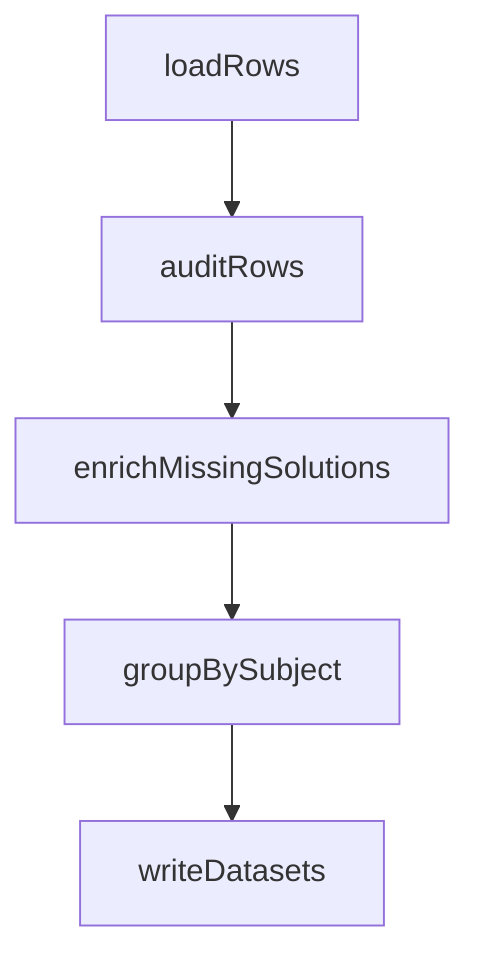

# LangChain / LangGraph 集成计划

## 当前落地

高考题库的数据集导出已经改为 LangGraph 编排，入口仍然兼容原命令：

```bash
npm run gaokao:langsmith
```

也可以直接运行图入口：

```bash
npm run gaokao:langgraph -- --print-graph-plan
```

图结构在 `scripts/langchain/gaokao-dataset-graph.mjs` 中定义，节点如下：

1. `loadRows`：从 PostgreSQL 读取 `gaokao_questions`、标签和元数据。
2. `auditRows`：过滤软删除、缺题干、缺答案、缺题解等不适合进入 LangSmith 的样本。
3. `enrichMissingSolutions`：可选节点，使用 LangChain chat model + structured output 为缺题解样本生成分步题解。
4. `groupBySubject`：按学科拆分为 JSONL examples。
5. `writeDatasets`：写入 `gaokao-*.jsonl`、`manifest.json` 和 `skipped.jsonl`。

## 推荐图结构



## 可继续编排的高阶能力

- **Structured output**：题解补全、题型标注、知识点标注都应该返回稳定 schema，而不是自由文本。
- **Checkpointing**：当前使用 `MemorySaver`，后续可换成 Postgres/Redis checkpoint，让长任务可恢复。
- **LangSmith tracing**：设置 `LANGSMITH_TRACING=true`、`LANGSMITH_API_KEY`、`LANGSMITH_PROJECT` 后，可观察每个节点的输入输出和耗时。
- **Human-in-the-loop**：对作文、材料题、OCR 不完整题，不自动进入训练集；后续可增加人工审核节点。
- **Conditional routing**：将题目按 `complete`、`needs_review`、`needs_enrichment`、`delete_candidate` 分流。
- **Map-reduce fan-out**：后续对九个学科并行跑清洗、题解补全、评测汇总，再 reduce 成全局 manifest。
- **Evaluator pipeline**：用 LangSmith dataset 跑标准答案一致性、题解步骤完整性、幻觉风险等自动评测。

## RAG 知识库导入

真题、答案、OCR 抽取和结构化 JSON 现在可以通过 LangGraph 写入 PostgreSQL RAG 表：

```bash
npm run gaokao:rag -- --dry-run
npm run gaokao:rag -- --clean
```

入口文件是 `scripts/langchain/gaokao-rag-graph.mjs`。默认扫描 `files`、`src/data`、`courses`，只收录路径或文件名包含高考、真题、试卷、答案、题库、OCR、exam、paper、question 等关键词的 `.json`、`.jsonl`、`.txt`、`.md`、`.pdf`、`.docx` 文件。

图节点如下：

1. `discoverFiles`：遍历资料根目录，并按考试资料规则过滤文件。
2. `extractDocuments`：用 LangChain `Document` 统一承载 JSON、JSONL、PDF、DOCX、文本和 Markdown 内容。
3. `splitDocuments`：用 `RecursiveCharacterTextSplitter` 按中文标点和换行切分为 RAG chunk。
4. `writeIndex`：写入 `gaokao_rag_documents`、`gaokao_rag_chunks`，并在 `gaokao_import_runs` 记录本次导入摘要。

结构化 JSON 中的每道题、每条答案覆盖、每一行 JSONL 都会写成独立 RAG 文档，`sourcePath` 使用 `文件路径#定位片段`，`metadata.physicalSourcePath` 保留原始文件路径，方便 admin 追溯。

常用维护命令：

```bash
# 只重新索引一个新目录或单个文件
npm run gaokao:rag -- --only-root "files/gaokao/2026"

# 强制指定学科
npm run gaokao:rag -- --only-root "files/gaokao/2026/math" --subject math

# 调整切片大小
npm run gaokao:rag -- --chunk-size 1000 --chunk-overlap 160
```

Rust 后端提供三个接口给前端学习页使用：

- `GET /api/gaokao/rag/summary`：返回文档数、切片数、学科分布、资料类型分布和最近导入。
- `GET /api/gaokao/rag/search?q=&subject=&docKind=&limit=`：按关键词、学科和资料类型检索 chunk。
- `POST /api/gaokao/rag/imports`：admin-only，登记新文件或目录，并返回建议运行的 `npm run gaokao:rag -- --only-root ...` 命令。

前端入口位于高考总览页和每个学科页的“RAG 知识库 / RAG 检索”区。普通用户只看到检索；admin 登录后才显示新文件导入表单和源路径。

## 本地模型补全

默认导出不会调用模型。如果需要让 LangChain 节点尝试补全缺失题解：

```bash
$env:LOCAL_MODEL_URL="http://127.0.0.1:11434/v1"
$env:LOCAL_MODEL_NAME="your-local-chat-model"
npm run gaokao:langgraph -- --enrich-missing-solutions --enrich-limit 10
```

补全结果只写入本次导出的 JSONL，不直接覆盖数据库。需要写回数据库时，应单独增加 `persistEnrichment` 节点，并保留人工复核状态。

## 设计边界

- PostgreSQL 仍是题库权威数据源。
- Rust 后端继续负责高响应 API 服务。
- LangChain / LangGraph 先用于离线数据工程、题解补全、评测与导出流程，不塞进前端运行时。
- RAG 入库也保持离线执行；浏览器只发起检索和 admin 导入登记，不直接读取本机文件系统。
- `skipped.jsonl` 是审计文件，不作为 LangSmith example 导入。
